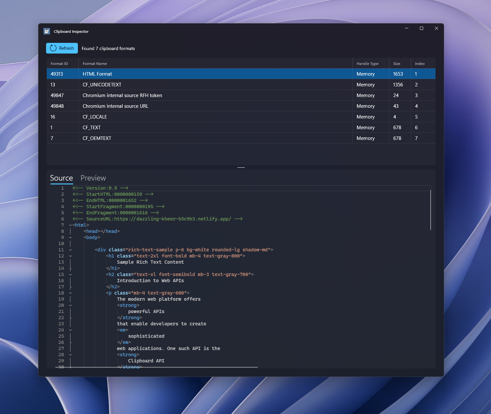

# Clipboard Inspector

  
   
  
<strong>A modern Windows clipboard data inspection tool</strong>

## 🔍 Overview

Clipboard Inspector is a lightweight, modern tool that lets you examine the contents of your Windows clipboard in rich detail. See what's really in your clipboard with support for multiple data formats, HTML preview, and a beautiful Windows 11-style interface.

## ✨ Features

- **Multi-Format Inspection** - View all available clipboard formats at once
- **Rich Content Preview** - Inspect text, HTML, and other clipboard data types
- **HTML Rendering** - Preview HTML content exactly as it would appear in a browser
- **Beautiful UI** - Modern Windows 11 design with Mica material effects
- **Customizable Layout** - Resize the interface to focus on the information you need

## 📸 Screenshots

## 🛠️ Technology

- Windows App SDK (WinUI 3)
- WebView2 for HTML preview
- WinUIEditor for high-performance large text rendering
- CommunityToolkit.WinUI controls

## 💡 Use Cases

- Web developers checking the structure of copied HTML
- Programmers debugging clipboard-related issues
- UI/UX designers verifying clipboard data
- Anyone curious about what's actually in their clipboard

## 🚀 Getting Started

1. Clone or download the repository
2. Open the solution in Visual Studio
3. Build and run the application
4. Copy content to your clipboard
5. Click "Refresh" to see all available clipboard formats

## 📝 License

MIT License

## 🤝 Contributing

Contributions are welcome! Feel free to submit issues, fork the repository and send pull requests.

---

  
Made with ❤️ for Windows users and developers

